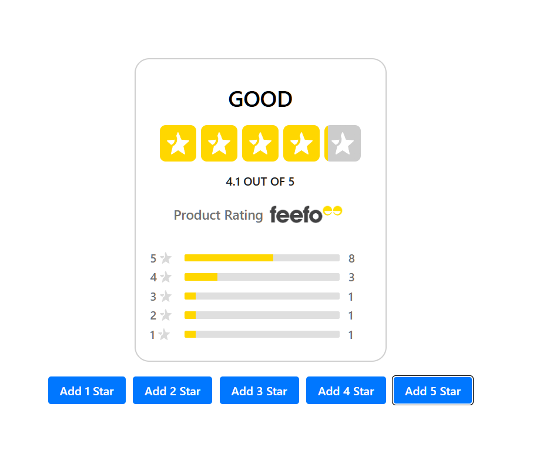

# Feefo frontend assesment

This is my submition for the frontend assement.

For this I have used the following:

- Vite
- Typescript
- Jest - RTL
- styled-components

Once cloned run the following to start the application in dev mode

- npm install
- npm run dev

To run the jest test suite run the command

- npm run test

My implementation starts with an empty rating widget with a number of buttons that add star ratings to the widget.

This shows that the UI is responsive and updates as expected.

